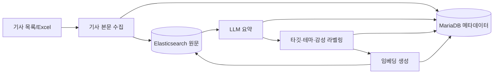

# News Dataset Pipeline

뉴스 기사 원문을 수집하고 LLM 기반 요약·라벨링과 임베딩을 수행하는 데이터 구축 파이프라인입니다.

이 코드는 `application/v1_batch`, `application/v2_async`의 서비스 버전과 독립된 작업 흐름입니다.

## 구성

```text
data_pipeline/
├── ingestion/
│   ├── article_content_crawler/  # 기사 본문 수집 및 상태 갱신
│   └── excel_importer/           # Excel 기사 목록 가져오기
├── enrichment/
│   └── article_ai_pipeline/      # 요약, 라벨링, 임베딩
├── operations/
│   └── troubleshooting_scripts/  # DB/ES 상태 점검 및 복구
└── infrastructure/
    ├── mariadb/
    └── elasticsearch/
```

## 처리 흐름



## 주요 진입점

### 기사 수집

- `ingestion/article_content_crawler/crawler.py`: 기사 본문 수집
- `ingestion/article_content_crawler/batch_updater_dataset.py`: 수집 대상 및 처리 상태 갱신
- `ingestion/excel_importer/article_import_excel.py`: Excel 데이터 가져오기

각 작업은 같은 디렉터리의 `config.ini`를 사용합니다.

### AI enrichment

`enrichment/article_ai_pipeline/main.py`에서 다음 실행 모드를 제공합니다.

```bash
cd data_pipeline/enrichment/article_ai_pipeline
python3 main.py summary
python3 main.py label
python3 main.py embed
python3 main.py all
```

특정 MariaDB 레코드만 처리할 때는 `--id`를 사용합니다.

```bash
python3 main.py all --id 123
```

모드별 역할:

| 모드 | 작업 |
| --- | --- |
| `summary` | Elasticsearch 원문을 읽어 LLM 요약 생성 |
| `label` | 타깃, 테마, 감성 라벨 및 confidence 생성 |
| `embed` | 기사 문맥 임베딩을 생성해 Elasticsearch에 저장 |
| `all` | 위 세 단계를 순서대로 실행 |

## 운영 도구

`operations/troubleshooting_scripts`에는 DB와 Elasticsearch 간 상태 확인, 누락 ID 보정, 임베딩 초기화 등을 위한 점검·복구 스크립트가 있습니다. 운영 데이터에 영향을 줄 수 있으므로 대상과 설정을 확인한 뒤 개별적으로 실행합니다.

## 관련 문서

- [`../docs/dataset_pipeline.md`](../docs/dataset_pipeline.md)
- [`../docs/model_training_serving.md`](../docs/model_training_serving.md)
- [`../docs/celery_redis.md`](../docs/celery_redis.md)

